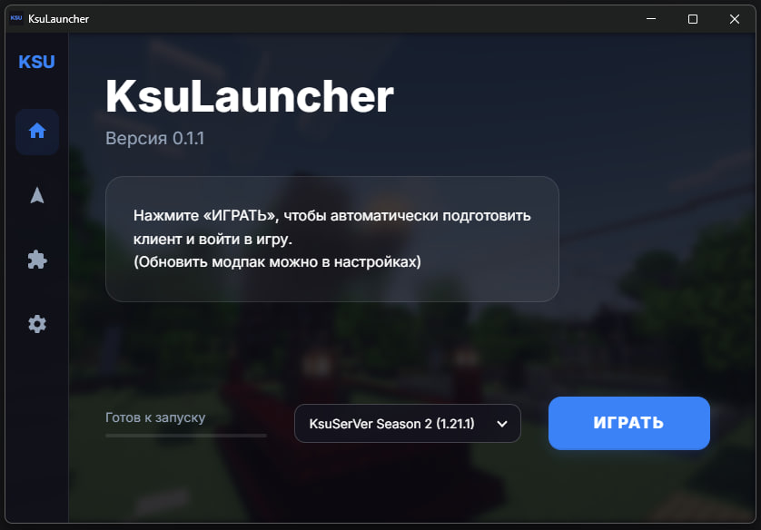

# ksuserver-launcher
Специализированный лаунчер, выполняющий строго конкретную функцию - настройка доступа к КсюСерВеру и установка моих сборок.



Алгоритм кнопок 
"Обновление (полностью)":
- устанавливает заданную версию игры
- устанавливает версию модлоадера (в том числе есть вариант с зеркалом)
- загружает архив со сборкой с gdrive
- удаляет папку mods и разархивирует архив со сборкой
- добавляет айпи сервера в список
- запускает игру (авторизация Ely.by, подгрузка скина)

"Обновление (только модпак)" - делает обновление с пропуском скачивания игры и модлоадера.

Процесс довольно объёмный,
<u>поэтому нажимать данные кнопки стоит лишь только при обновлении модпака или переустановке клиента.</u>

Кнопка "Играть" - делает лишь последнее действие (там умный пропуск, подходит для первого запуска)

В качестве приятного бонуса - есть фичи загрузки шейдеров и ресурспаков и шейдеров, добавление модов (спасибо Ma3stro567).

---

В планах - сделать авторизацию через OAuth, отладить приложение (например при неправильно введённых данных), возможно переписать на что-то более оптимизированное и прикрутить сертификат.

Для интересующихся на попрогать:
- Python 3.14
- minecraft_launcher_lib 8.0
- pyinstaller 6.19.0
- остальные либы, актуальные по состоянию на 05.04.2026, перечислены в *requirements.txt*

Ну и можете [писать](http://t.me/thirdBTP?direct) мне, естественно

Команда для сборки .exe:
```
cd ksu_launcher_app
pyinstaller --onefile --noconsole --icon=view/app.ico --name=KsuLauncher --add-data "view;view" --add-binary "authlib-injector-1.2.7.jar;." controller.py
```

---

Сам я пользовался документацией по [либе](https://minecraft-launcher-lib.readthedocs.io/en/stable/examples/index.html) и [инжектору](https://docs.ely.by/ru/authlib-injector.html), метанитом, Stack Overflow, ну и с дипсиком мило пообщались.
Инжектор оставил здесь для удобства, но вообще он [отсюда](https://github.com/yushijinhun/authlib-injector/releases)

- Первая версия - написана мной за сутки, параллельно с настройкой сервера.
- Со второй, благодаря помощи Ma3stro567, lmll_llml, AntGame30, управились за пару дней.